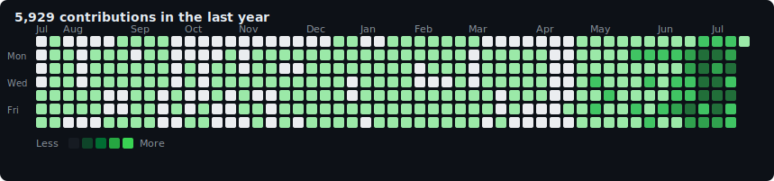

# Hi, I'm saushank 👋

📍 **Dubai** | 💎 **Co-Founder, [Diamond Hands](https://diamondhand.gg)** | 🤖 **Building with agents**

Operators-first crypto shop: liquid markets, early-stage teams, and internal tooling that moves at machine speed.

## Diamond Hands — Trading & research

- **[BTPulseTrader](https://github.com/DiamondHandsQuant/BTPulseTrader)** — Quant strategy engine
- **[quantfun](https://github.com/DiamondHandsQuant/quantfun)** — PulseTrader
- **[dexter](https://github.com/DiamondHandsQuant/dexter)** — Nansen backtester engine
- **[polymarket](https://github.com/DiamondHandsQuant/polymarket)** — Polymarket trading strategies
- **[yield-farming](https://github.com/DiamondHandsQuant/yield-farming)** — Yield farming bots

## Agentic products

- **[fanmarkets](https://github.com/DiamondHandsQuant/fanmarkets)** — Fan Markets (WIP) — prediction markets
- **[hyper-orchestrator](https://github.com/DiamondHandsQuant/hyper-orchestrator)** — Custom harness across Codex, Claude, and Cursor
- **[twitter-reply-workflow](https://github.com/DiamondHandsQuant/twitter-reply-workflow)** — Twitter post agents

## Personal

- **[personal-agent-workspace](https://github.com/saushank3poch/personal-agent-workspace)** — Personal agent stack for daily work (Codex / Claude Code)
- **[ai-course](https://github.com/saushank3poch/ai-course)** — AI Chief of Staff for everyone (WIP)
- **[obsidian-qmd-search](https://github.com/DiamondHandsQuant/obsidian-qmd-search)** — QMD + Obsidian search for knowledge management

## Public

- **[spam-the-spammer](https://github.com/saushank3poch/spam-the-spammer)** — Fun public project: fight spam callers with automated public shaming

## What I'm doing

- **Building Diamond Hands** — operators first, investors second; only back what we’re willing to build alongside
- **Agentic engineering** — shipping trading, research, and GTM workflows with coding agents
- **Learning in public** — smaller public tools while the core stack stays private for now

## GitHub Activity

## Connect

---

### Previously

- Co-Founder, **3poch**
- Founder, **RefreshMint**
- Head of Marketing & Sales / CX, **PaySense**
- Head–India Trust Operations, **eBay**
- Commercial Banking, **Citi**

### Philosophy

> Ship the system that makes the next trade, decision, or GM easier — then tighten it in production.
